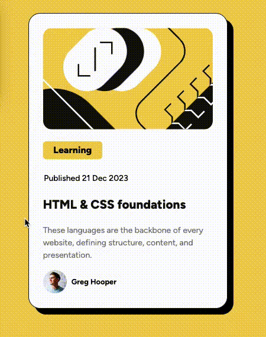

# Frontend Mentor - Blog preview card solution

This is a solution to the [Blog preview card challenge on Frontend Mentor](https://www.frontendmentor.io/challenges/blog-preview-card-ckPaj01IcS). Frontend Mentor challenges help you improve your coding skills by building realistic projects.

## Table of contents

- [Frontend Mentor - Blog preview card solution](#frontend-mentor---blog-preview-card-solution)
  - [Table of contents](#table-of-contents)
  - [Overview](#overview)
    - [The challenge](#the-challenge)
- [Demo](#demo)
    - [Links](#links)
  - [My process](#my-process)
    - [Built with](#built-with)
    - [What I learned](#what-i-learned)
    - [Continued development](#continued-development)
  - [Author](#author)

**Note: Delete this note and update the table of contents based on what sections you keep.**

## Overview

### The challenge

Users should be able to:

- See hover and focus states for all interactive elements on the page

# Demo

### Links

- Live Site URL: [https://kaiens-lab.github.io/frontend-mentor-solutions/02-blog-preview-card/]

## My process

### Built with

- Semantic HTML5 markup
- Flexbox
- SCSS (Sass)
- Responsive design

### What I learned

- Naming structure for consistency.
- Custom shadow variables and make them interactive.

### Continued development

Continuously learning SCSS to make my code more concise and understandable.

## Author

- Frontend Mentor - [@kaiens-lab](https://www.frontendmentor.io/profile/kaiens-lab)
