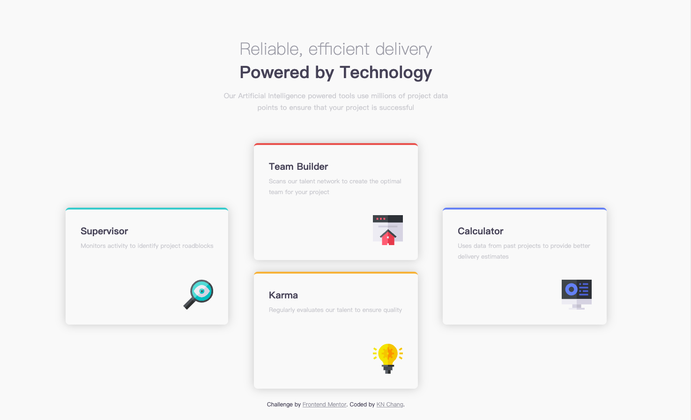

# Frontend Mentor - Four card feature section solution

This is a solution to the [Four card feature section challenge on Frontend Mentor](https://www.frontendmentor.io/challenges/four-card-feature-section-weK1eFYK). Frontend Mentor challenges help you improve your coding skills by building realistic projects.

## Table of contents

- [Frontend Mentor - Four card feature section solution](#frontend-mentor---four-card-feature-section-solution)
  - [Table of contents](#table-of-contents)
  - [Overview](#overview)
    - [The challenge](#the-challenge)
    - [Screenshot](#screenshot)
    - [Links](#links)
  - [My process](#my-process)
    - [Built with](#built-with)
    - [What I learned](#what-i-learned)
  - [Author](#author)

## Overview

### The challenge

Users should be able to:

- View the optimal layout for the site depending on their device's screen size

### Screenshot

### Links

- Solution URL: [Four Card Features Section](https://www.frontendmentor.io/solutions/four-card-feature-section-K_Jev-_bj6)
- Live Site URL: [Four Card Features Section](https://kaiens-lab.github.io/frontend-mentor-solutions/06-four-card-feature-section/)

## My process

### Built with

- Semantic HTML5 markup
- CSS custom properties
- Flexbox
- CSS Grid
- Responsive design using media queries

### What I learned

In this challenge, what I gained the most wasn't the new tools I learned, but the application of logic.

When faced with a problem, try breaking it down and then reassembling it. In my case, thinking in terms of four separate boxes was very confusing at first. However, when I grouped the second and third boxes together and applied properties to them, it became much easier to distinguish the areas.

This approach helped me organize and manage the content more effectively, improving both my design efficiency and the clarity of the results.

## Author

- Frontend Mentor - [@KN Chang](https://www.frontendmentor.io/profile/kaiens-lab)
